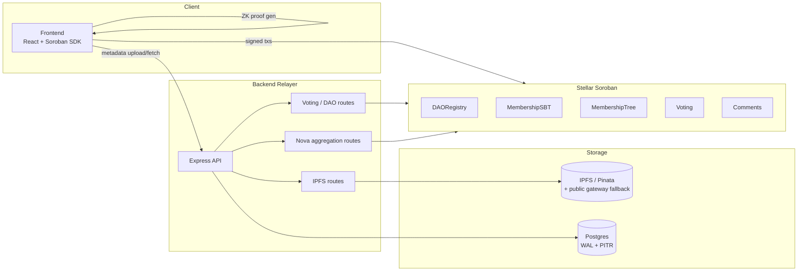

# ZK-VOTE Documentation Index

Issue #384: this repo's `docs/` directory has 20+ standalone documents with
no index, so finding the right one meant grepping filenames. This page
groups them by topic and adds a full-stack architecture diagram. Nothing
below has been rewritten or merged — see [Note on overlapping docs](#note-on-overlapping-docs)
for the one pair worth a closer editorial pass later.

## System Architecture

The README's [Architecture](../README.md#architecture) section diagrams the
on-chain contract flow (`DAORegistry → MembershipSBT → MembershipTree →
Voting → Comments`). This diagram complements it with the full stack —
where the frontend, backend relayer, IPFS, and the contract layer fit
together:

## Protocol & Zero-Knowledge

- [zk-voting-protocol.md](zk-voting-protocol.md) — anti-flash-loan voting mechanism
- [recursive-proof-architecture.md](recursive-proof-architecture.md) — Nova/SuperNova recursive proof composition ($O(1)$ on-chain verification at scale)
- [vdf-randomness.md](vdf-randomness.md) — verifiable delay function for election randomness
- [bn254-edge-case-findings.md](bn254-edge-case-findings.md) — BN254 Groth16 edge-case findings
- [adr-0001-bn254-groth16-validation-boundary.md](adr-0001-bn254-groth16-validation-boundary.md) — ADR: BN254 Groth16 validation boundary
- [trusted-setup-ceremony.md](trusted-setup-ceremony.md) — multi-party trusted setup ceremony
- [voter-guide.md](voter-guide.md) — HD multi-election key management for voters

## Curve & Proof System Migration

- [adr/001-curve-migration.md](adr/001-curve-migration.md) — ADR: BN254 → BLS12-381 curve migration
- [roadmap/curve-migration.md](roadmap/curve-migration.md) — curve migration implementation roadmap
- [plonk-halo2-migration-evaluation.md](plonk-halo2-migration-evaluation.md) — evaluation: Groth16 → PLONK/Halo2 (issue #113)

## Post-Quantum

- [post-quantum-evaluation.md](post-quantum-evaluation.md) — STARK-based circuit evaluation (Cairo/Miden vs Groth16)
- [post-quantum-roadmap.md](post-quantum-roadmap.md) — multi-phase post-quantum transition roadmap

## Contracts & On-Chain Storage

- [contract-upgrade-framework.md](contract-upgrade-framework.md) — contract upgrade framework
- [schema-versioning.md](schema-versioning.md) — database schema versioning
- [token-storage-ttl-strategy.md](token-storage-ttl-strategy.md) — token contract storage & TTL strategy (issue #112)
- [token-sep41-event-audit.md](token-sep41-event-audit.md) — SEP-41 event schema audit (issue #111)
- [error-codes.md](error-codes.md) — ZKVote error codes reference

## Backend Resilience & Operations

- [ipfs-architecture.md](ipfs-architecture.md) — IPFS pinning redundancy architecture
- [WAL_RESILIENCE.md](WAL_RESILIENCE.md) — WAL resilience & database reliability
- [BACKUP_RECOVERY.md](BACKUP_RECOVERY.md) — database backup & point-in-time recovery
- [secrets-management.md](secrets-management.md) — secrets management architecture
- [secure-logging.md](secure-logging.md) — secure logging with PII redaction
- [CSP.md](CSP.md) — Content Security Policy implementation

## Security Findings & Mitigations

- [approve-race-mitigation.md](approve-race-mitigation.md) — ERC-20 approve race condition mitigation
- [adr/002-approve-race-mitigation.md](adr/002-approve-race-mitigation.md) — ADR record for the same mitigation

## Build & Tooling

- [PR-117-deterministic-compilation.md](PR-117-deterministic-compilation.md) — deterministic compilation for circuit artifacts
- [frontend-contract-client-migration.md](frontend-contract-client-migration.md) — `initializeContractClients` call-site audit & unified client migration (issue #368)

---

## Note on overlapping docs

[`approve-race-mitigation.md`](approve-race-mitigation.md) and
[`adr/002-approve-race-mitigation.md`](adr/002-approve-race-mitigation.md)
cover the same fix from two angles (a detailed write-up vs. a short ADR
record) — genuinely overlapping content, not just similarly named. Merging
them means deciding which one is authoritative and risks losing detail from
whichever gets folded in, so that's left for a follow-up with someone who
can review the content, not done as part of this pass. Everything else in
this index is topically related but not actually duplicated.
